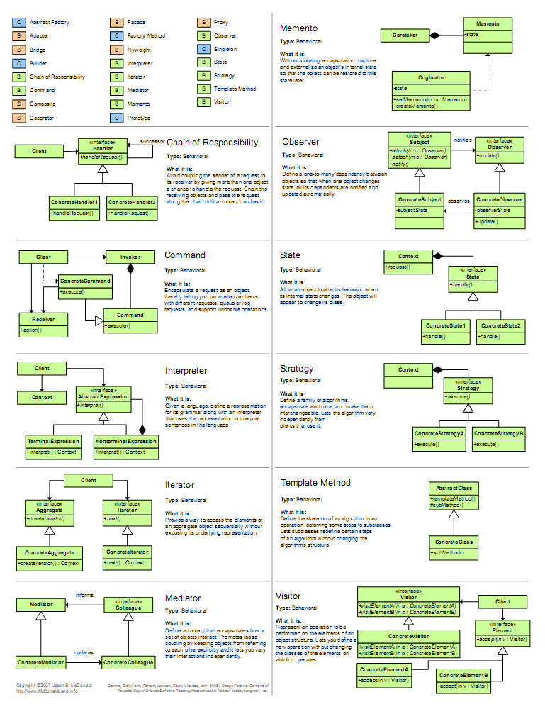
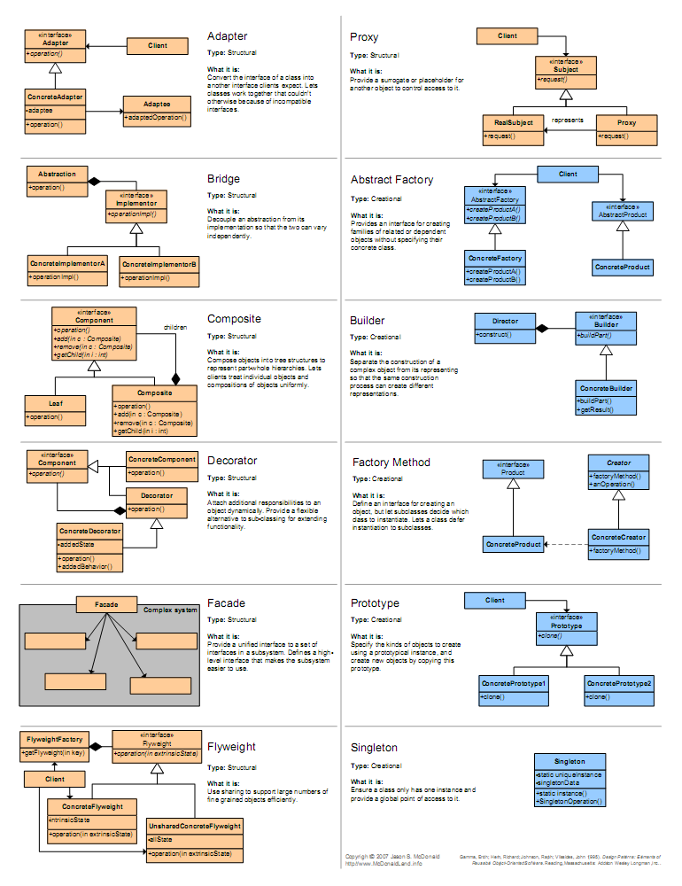
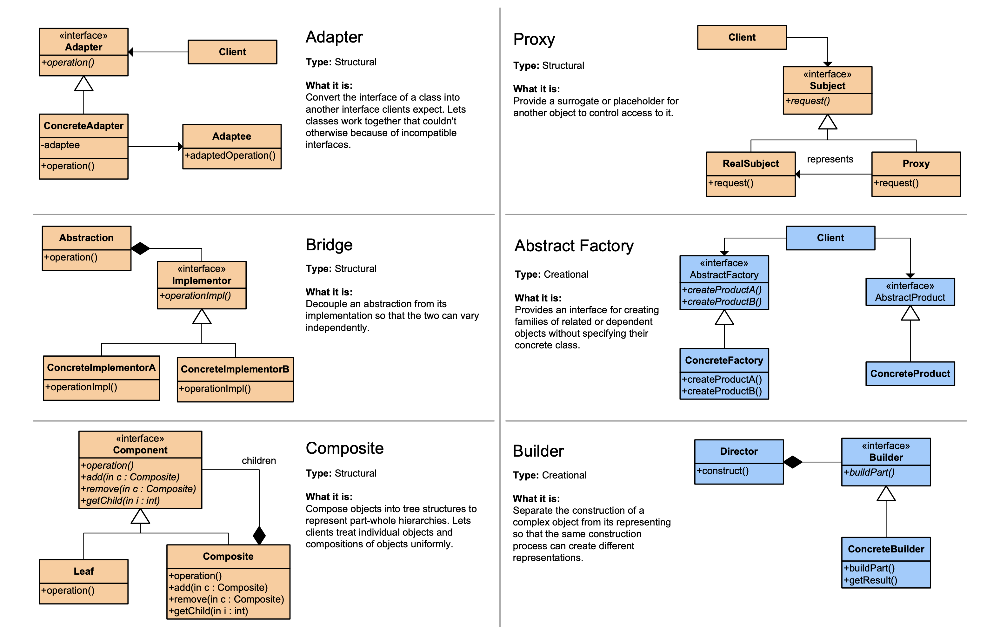
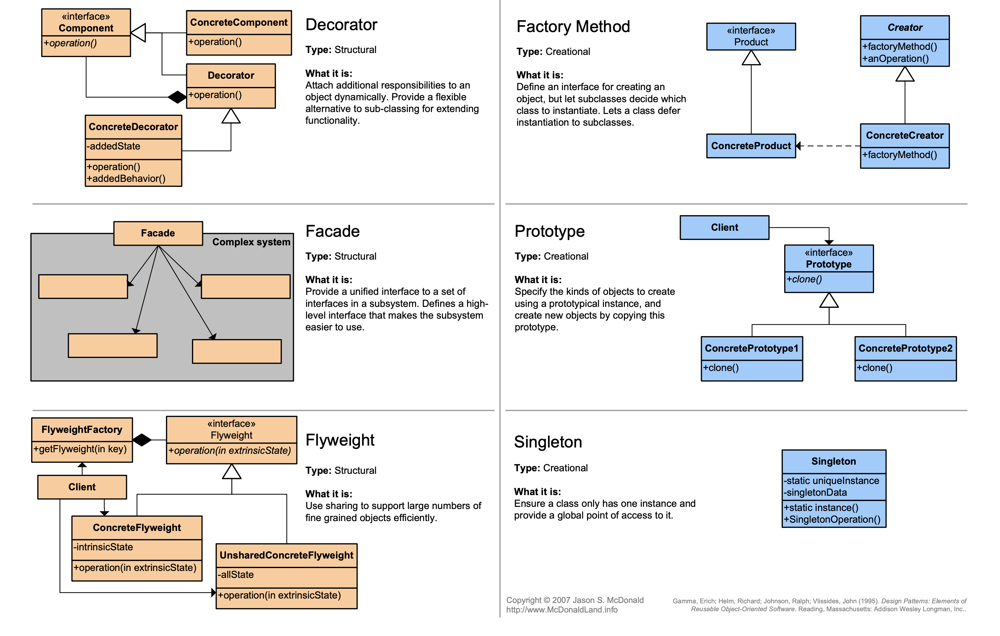

# 디자인 패턴 (Design Pattern)
 

#### * 디자인 패턴이란?
https://dailyworker.github.io/java-design-pattern  
https://gmlwjd9405.github.io/2018/07/06/design-pattern.html  
http://sjava.net/2008/07/design-pattern-quick-reference-image  
 

#### * 결합도, 응집도
결합도는 낮고, 응집도는 높을수록 좋다.
   

 
 
 
 
  

## 1. 템플릿 메소드 패턴 (Template Method Pattern)
메소드에서 알고리즘의 골격을 정의한다. 
알고리즘의 여러 단계 중 일부는 서브클래스에서 구현할 수 있다. 
템플릿 메소드를 이용하면 알고리즘의 구조는 그대로 유지하면서 서브 클래스에서 특정 단계를 재정의 할 수 있다. 
알고리즘의 틀을 만들기 위한 패턴이다. 
이 패턴에서 틀(템플릿)이란 일련의 단계들로 알고리즘을 정의한 메소드다. 
여러 단계 가운데 하나 이상이 추상 메소드로 정의되며, 그 추상 메소드는 서브클래스에서 구현된다. 
이렇게 하면 서브클래스에서 일부분의 단계를 구현할 수 있도록 하면서도 알고리즘의 구조는 바꾸지 않도록 할 수 있다. 
어떤 작업을 처리하는 일부분을 서브 클래스로 캡슐화해  
전체 일을 수행하는 구조는 바꾸지 않으면서 특정 단계에서 수행하는 내용을 바꾸는 패턴. 
즉, 전체적으로는 동일하면서 부분적으로 다른 구문으로 구성된 메소드의 코드 중복을 최소화할 때 유용하다. 
다른 관점에서 보면 동일한 기능을 상위 클래스에서 정의하면서 확장/변화가 필요한 부분만 서브 클래스에서 구현할 수 있도록 한다. 
 
=> templateMethod 패키지 참조. 
https://jusungpark.tistory.com/24  
  

## 2. 프록시 패턴 (Proxy Pattern)
클라이언트에서 프록시 클래스를 통해 간접적으로 주체 클래스를 사용하는 방식. 
프록시가 대리자로써 일을 처리하고 완료되면 결과를 알려주는 패턴. 
프록시의 의미는 "대리자"라는 의미이다. 
무언가를 대신해서 일을 해주는 사람을 말하는데 프록시패턴(Proxy Pattern)은 
대리자로써 일을 맡기면 그 일을 처리하고 완료되면 결과를 알려주는 패턴이다. 
#### * 프록시 종류
(1) 원격 프록시(원격에서 모니터링 하는 경우.) 
(2) 가상 프록시(이미지를 불러오는 동안 무언가 다른것을 보여주고 싶을 때.) 
(3) 동적 프록시(자바 리플렉션 사용. 프록시 클래스가 실행중에 생성됨. 사용자 권한에 따라 다른 페이지 보여줄 때.) 
(4) 방화벽 프록시(네트워크 자원에 대한 접근을 제어함으로써 객체를 공격자로부터 보호.) 
(5) 스마트 패턴 프록시(주 객체가 참조될 때마다 추가 행동을 제공. 래퍼런스 개수 세기 등.) 
(6) 캐싱 프록시(비용이 많이 드는 작업의 결과를 임시로 저장. 웹 서버 프록시, 컨텐츠 관리 및 퍼블리싱 시스템.) 
(7) 동기화 프록시(여러 스레드에서 주 객체에 접근하는 경우 안전하게 작업을 처리하게 해준다.) 
(8) 복잡도 숨김 프록시(퍼사드 패턴이 단순히 인터페이스만 제공하는 것에 비해 복잡도 숨김 프록시는 접근을 제어한다.) 
(9) 지연 복사 프록시(객체 복사를 제어한다.) 
 
=> proxy 패키지 참조. 
https://plposer.tistory.com/31  
https://meylady.tistory.com/58  
  

## 3. 퍼사드 패턴 (Facade Pattern)
인터페이스를 간단하게 바꿈 (for 간편함) 
어떤 서브시스템에 대한 간단한 인터페이스를 제공하기 위한 용도. 
퍼사드에서 고수준 인터페이스를 정의하기 때문에 서브시스템을 더 쉽게 사용할 수 있다. 
클라이언트와 서브시스템이 서로 긴밀하게 연결되지 않아도 되고 최소 지식 원칙을 준수하는데 도움을 준다. 
* 최소 지식 원칙: 정말 친한 친구하고만 얘기하라. 
 
=> facade 패키지 참조. 
https://jusungpark.tistory.com/23?category=630296  
  

## 4. 싱글톤 패턴 (Singleton Pattern)
인스턴스를 한번만 생성해서 사용하턴 패턴. 
해당 클래스의 인스턴스가 하나만 만들어지고, 어디서든지 그 인스턴스에 접근할 수 있도록 하기 위한 패턴. 
클래스에서 자신의 단 하나뿐인 인스턴스를 관리하도록 만든다. 
다른 어떤 클래스에서도 자신의 인스턴스를 추가로 만들지 못하도록 해야한다.  
멀티 스레드 환경에서 잘 고려해서 사용해야 한다. 
(동기화 사용 시 속도 저하 -> 부분적으로만 사용, 혹은 클래스 로딩 시 인스턴스 생성.)  
 
=> singleton 패키지 참조. 
https://jusungpark.tistory.com/16?category=630296  
  

## 5. 전략 패턴 (Strategy Pattern)
실행 중에 알고리즘을 선택할 수 있게 하는 패턴. 
알고리즘군을 정의하고 각각 캡슐화하여 교환해서 사용할 수 있도록 만든다. 
스트래티지 패턴을 활용하면 알고리즘을 사용하는 클라이언트와는 독립적으로 알고리즘을 변경할 수 있다. 
 
=> strategy 패키지 참조. 
https://jusungpark.tistory.com/7?category=630296  
  

## 6. 팩토리 패턴 (Factory Pattern)
객체를 만들어내는 공장을 만드는 패턴. 
(1) 팩토리 메소드 패턴 
클래스의 인스턴스를 만드는 일을 서브 클래스에게 맡기는 것. 
(2) 추상 팩토리 패턴 
인터페이스를 이용하여 서로 연관된, 또는 의존하는 객체를 구상 클래스를 지정하지 않고 생성하는 것. 
 
=> factory 패키지 참조. 
factoryMethod 패키지와 재료 팩토리가 추가된 abstractFactory 패키지에서  
각각 NYPizzaStore 클래스의 createPizza()를 보면  
팩토리 메소드 패턴과 추상 팩토리 패턴에 대해 참조할 수 있다.  
https://jusungpark.tistory.com/14?category=630296  
  

## 7. 어댑터 패턴 (Adapter Pattern)
한 인터페이스를 다른 인터페이스로 변환 (for 호환성) 
인터페이스를 변경해서 클라이언트에서 필요로 하는 인터페이스로 적응시키기 위한 용도. 
어댑터를 이용하면 인터페이스 호환성 문제 때문에 같이 쓸 수 없는 클래스들을 연결해서 쓸 수 있다. 
 
=> adapter 패키지 참조. 
https://jusungpark.tistory.com/22?category=630296  
  

## 8. 데코레이터 패턴 (Decorator Pattern)
인터페이스를 바꾸지 않고 책임(기능)만 추가함. (For 기능 추가) 
객체에 추가적인 요건을 동적으로 첨가한다.  
서브 클래스를 만드는 것을 통해서 기능을 유연하게 확장할 수 있는 방법을 제공한다. 
- 데코레이터가 적용된 예: Java I/O  
InputStream이 추상 구성요소이고, 모든 보조 스트림의 조상인 FileInputStream이 추상 데코레이터이다. 
FileInputStream을 상속받아 구현하는 BufferedInputStream 클래스들이 구상 데코레이터이다. 
InputStream을 상속받는 FileInputStream 같은 기반 스트림들은 데코레이터로 포장될 구상 구성요소 역할을 한다.  
 
=> decorator 패키지 참조. 
https://jusungpark.tistory.com/9?category=630296  
  

## 9. 컴포지트 패턴 (Composite Pattern)
객체들을 트리 구조로 구성하여 부분과 전체를 나타내는 계층구조로 만들 수 있다. 
클라이언트에서 개별 객체와 다른 객체들로 구성된 복합객체(composite)를 똑같은 방법으로 다룰 수 있다. 
식당 메뉴를 예로들어 생각해본다면 중첩되어 있는 메뉴 그룹과 메뉴 항목을 똑같은 구조내에서 처리할 수 있게끔 하는 것이다. 
메뉴와 메뉴항목을 같은 구조에 집어넣어서 부분-전체 계층구조를 생성할 수 있다. 
이런 복합구조를 사용하면 복합객체와 개별객체에 대해 구분없이 똑같은 작업을 적용할 수 있다. 
 
=> composite 패키지 참조. 
https://jusungpark.tistory.com/26?category=630296  
  

## 10. 이터레이터 패턴 (Iterator Pattern)
컬렉션 구현 방법을 노출시키지 않으면서도 그 집합체 안에 들어있는 모든 항목에 접근할 수 있는 방법을 제공한다. 
컬렉션 객체 안에 들어있는 모든 항목에 접근하는 방식이 통일되어 있으면 
어떤 종류의 집합체에 대해서도 사용할 수 있는 다형적인 코드를 만들 수 있다. 
이터레이터 패턴을 사용하면 모든 항목에 일일이 접근하는 작업을 컬렉션 객체가 아닌 반복자 객체에서 맡게 된다. 
이렇게 하면 집합체의 인터페이스 및 구현이 간단해질뿐 아니라 
집합체에서는 반복작업에서 손을 떼고 원래 자신이 할 일(객체 컬렉션 관리)에만 전념할 수 있다. 
 
=> iterator 패키지 참조. 
https://jusungpark.tistory.com/25?category=630296  
  

## 11. 커맨드 패턴 (Command Pattern)
요구사항을 객체로 캡슐화 할 수 있으며, 매개변수를 써서 여러가지 다른 요구사항을 집어넣을 수 있다. 
또한 요청 내역을 큐에 저장하거나 로그로 기록할 수도 있으며 작업 취소 지원도 가능하다.  
커맨드 객체는 일련의 행동을 특정 리시버하고 연결시킴으로써 요구사항을 캡슐화한다. 
이렇게 하기 위해 행동과 리시버를 한 객체에 집어넣고 메소드 하나만 외부에 공개하는 방법을 사용한다. 
 
예) 식당을 예로 들어보자.  
(1) 손님이 웨이터에게 주문을 한다. 
(2) 웨이터가 고객의 주문을 주문서에 적는다. 
(3) 웨이터는 주문서를 주방에 전달하여 주문을 요청한다. 
(4) 요리사는 주문서에 적힌 주문대로 음식을 자신의 노하우로 만든다. 
- 손님 => 클라이언트
- 웨이터 => 인보커 객체
- 주문서 => 커맨드 객체
- 주방장 => 리시버 객체
- 주문을 하는 것 => setCommand()
- 주문을 요청하는 것 => execute()
 
=> command 패키지 참조.  
https://jusungpark.tistory.com/18?category=630296  
  

## 12. 옵저버 패턴 (Observer Patter)
한 객체의 상태가 바뀌면 그 객체에 의존하는 다른 객체들한테 연락이 가고  
자동으로 내용이 갱신되는 방식으로 일대다(one-to-many) 의존성을 정의한다. 
옵저버 패턴을 구현하는 방법에는 여러가지가 있지만 대부분 상태를 저장하고 있는 주제 인터페이스를 구현한 주제 객체와 
주제 객체에 의존하고 있는 옵저버 인터페이스를 구현한 여러개의 옵저버 객체가 있는 디자인을 바탕으로 한다. 
 
데이터 전달 방식은 2가지가 있다. 
 
(1) 주제 객체에서 옵저버로 데이터를 보내는 방식 (푸시 방식) 
-> observer.push 패키지 참조. 
 
(2) 옵저버에서 주제 객체의 데이터를 가져가는 방식 (풀 방식) 
-> 자바 9부터 deprecated 됨. 
-> 자바 내장 옵저버 사용하는 방식. 푸시 방식, 풀 방식 모두 사용가능.  
 
=> observer 패키지 참조.  
https://jusungpark.tistory.com/8?category=630296  
  

## 13. 스테이트 패턴 (State Pattern)
일련의 규칙에 따라 객체의 상태(State)를 변화시켜, 객체가 할 수 있는 행위를 바꾸는 패턴. 
 
=> state 패키지 참조.  
https://victorydntmd.tistory.com/294  
https://www.journaldev.com/1751/state-design-pattern-java  
  

## 14. 컴파운드 패턴 (Compound Pattern)
패턴 섞어 쓰기. 
반복적으로 생길 수 있는 문제를 해결하기 위한 용도로 두 개 이상의 패턴을 결합하여 사용하는 것을 뜻함. 
 
=> compound 패키지 참조.  
<pre>
- 오리에 적용될 패턴.
(1) 처음에 수많은 Quackable들이 존재.
(2) 갑자기 거위가 나타나서는 자기도 Quackable이 되고 싶다고 함. (어댑터 패턴)
(3) 꽥 학자들이 등장해서 꽥 소리 횟수를 세고 싶다고 함. (데코레이터 패턴)
(4) 꽥 학자들이 QuackCounter로 장식되지 않은 Quackable 객체가 있을지도 모른다는 걱정을 함.
    모든 객체를 팩토리에서 만들도록 바꿈. (추상 팩토리 패턴)
(5) 모든 오리와 거위, Quackable 객체들을 관리하는게 힘들어지기 시작하여 오리떼 계층구조로 관리. (컴포지트 패턴)
(6) 꽥 학자들은 Quackable에서 꽥 소리를 냈을 때 알림을 받고 싶어함. (옵저버 패턴)
</pre>
http://wiki.gurubee.net/pages/viewpage.action?pageId=1507417  
  

## 15. 브리지 패턴 (Bridge Pattern)
구현부에서 추상층을 분리하여 각자 독립적으로 변형할 수 있게 하는 패턴. 
두 클래스 간의 강한 결합을 제거하기 위해서 사요하는 패턴이다. 
두 클래스 모두 추상화된 상위 클래스 또는 인터페이스를 가지게 되고, 의존성은 상위 타입간에만 이루어지게 된다. 
이를 통해 실제 의존성이 발생하더라도 서로의 구현체는 알 수 없도록 한다. 
이렇게 되면 두 상위 타입을 구현하는 구현체들은 변경이 가능한 상태가 된다. 
 
=> bridge 패키지 참조. 
https://ko.wikipedia.org/wiki/%EB%B8%8C%EB%A6%AC%EC%A7%80_%ED%8C%A8%ED%84%B4  
 
### * 어댑터 패턴과 브리지 패턴의 차이
구조 패턴은 코드와 객체를 구조화하기 위해 언어가 제공하는 아주 작은 범위의 개념을 이용하기 때문에 각 패턴이 구조가 비슷할 수 밖에 없다. 
이러한 패턴들의 차이점은 왜 이 패턴을 써야 하는가에 있다. 
<pre>
어댑터 패턴과 브리지 패턴은 둘 다 객체에 대한 직접 접근 대신에 다른 우회적 방법으로 접근함으로써 유연성을 증대시킨다.
두 패턴간의 가장 큰 차이는 목적이 무엇인가라는 것이다.
어댑터 패턴의 목적은 이미 존재하는 두 인터페이스 간의 불일치를 해결하려는 것이다.
어댑터 패턴은 어떤 인터페이스를 어떻게 구현하게 할 것이라든가,
인터페이스와 구현을 독립적으로 발전시키는 방법은 무엇일까 등의 사항은 전혀 고려치 않는다.
이에 비해 브리지 패턴의 경우는 추상화 개념과 구현을 따로 만들고, 이들을 연결시키려는 것이 주 목적이다.
어댑터 패턴은 두 클래스 간의 종속성을 미리 예측하지 못하고 개발했을 경우에 필요한 패턴이고,
브리지 패턴은 이미 사용자가 추상화 개념을 구현하는 방법이 여러가지이고
이들 각각이 독립적으로 진화할 수 있음을 파악한 상태에서 적용하는 패턴이다.
</pre>
https://gyrfalcon.tistory.com/entry/Adapter-vs-Bridge-Composite-vs-Decorator-vs-Proxy-%EB%B9%84%EA%B5%90  
  

## 16. 빌더 패턴 (Builder Pattern)
객체 생성 알고리즘과 조립 방법을 분리하는 것이 목적. 
코드 읽기/유지보수가 편해짐. 
생성자 인자가 많을 때는 빌더 패턴을 고려. 
메소드 체인 방식으로 호출 가능.  
 
=> builder 패키지 참조. 
https://johngrib.github.io/wiki/builder-pattern  
  

## 17. 역할 사슬 패턴 (Chain Of Responsibility Pattern)
여러 개의 객체 중에서 어떤 것이 요구사항을 처리할 수 있는지 사전에 알 수 없을 때 사용. 
요청 처리가 들어오면 그것을 수신한 객체가 자신이 처리할 수 없을 때 다음 객체에게 문제를 넘김으로써 
최종적으로 요청을 처리할 수 있는 객체에 의해 처리가 가능하도록 하는 패턴. 
 
=> chain 패키지 참조. 
https://lktprogrammer.tistory.com/45  
https://sexycoder.tistory.com/105  
http://www.nextree.co.kr/p2533/  
https://kunoo.tistory.com/entry/%ED%96%89%EC%9C%84-%ED%8C%A8%ED%84%B4-Chain-of-responsibility-pattern-%EC%97%AD%ED%95%A0-%EC%82%AC%EC%8A%AC-%ED%8C%A8%ED%84%B4  
  

## 18. 플라이웨이트 (Flyweight Pattern)
 
=> flyweight 패키지 참조. 
https://m.blog.naver.com/2feelus/220669069127  
  

## 19. 인터프리터 패턴 (Interpreter Pattern)
 
=> interpreter 패키지 참조.  
https://kunoo.tistory.com/entry/%ED%96%89%EC%9C%84-%ED%8C%A8%ED%84%B4-Interpreter-pattern-%EC%9D%B8%ED%84%B0%ED%94%84%EB%A6%AC%ED%84%B0-%ED%8C%A8%ED%84%B4  
  

## 20. 중재자 패턴 (미디에이터 패턴, Mediator Pattern)
 
=> mediator 패키지 참조. 
https://palpit.tistory.com/201  
https://kunoo.tistory.com/entry/%ED%96%89%EC%9C%84-%ED%8C%A8%ED%84%B4-Mediator-pattern-%EB%AF%B8%EB%94%94%EC%97%90%EC%9D%B4%ED%84%B0-%ED%8C%A8%ED%84%B4  
  

## 21. 메멘토 패턴 (Memento Pattern)
객체의 상태 정보를 저장하고 사용자의 필요에 의하여 원하는 시점의 상태로 복원할 수 있는 패턴. 
 
=> memento 패키지 참조. 
https://lktprogrammer.tistory.com/65  
  

## 22. 프로토타입 패턴 (Prototype Pattern)
 
=> prototype 패키지 참조. 
  

## 23. 비지터 패턴 (Visitor Pattern)
 
=> visitor 패키지 참조.  
  

  

