# 디자인 패턴 (Design Pattern)
 

#### * 디자인 패턴이란?
https://dailyworker.github.io/java-design-pattern  
https://gmlwjd9405.github.io/2018/07/06/design-pattern.html  
http://sjava.net/2008/07/design-pattern-quick-reference-image  
https://ko.wikipedia.org/wiki/%EB%94%94%EC%9E%90%EC%9D%B8_%ED%8C%A8%ED%84%B4_(%EC%B1%85)  
 

#### * 결합도, 응집도
결합도는 낮고, 응집도는 높을수록 좋다.
   

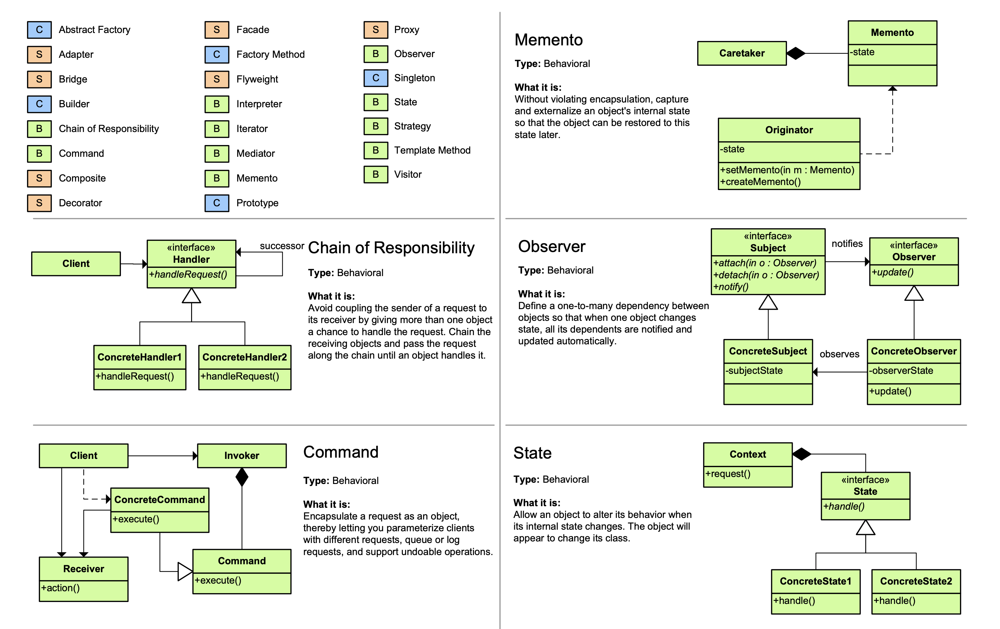 
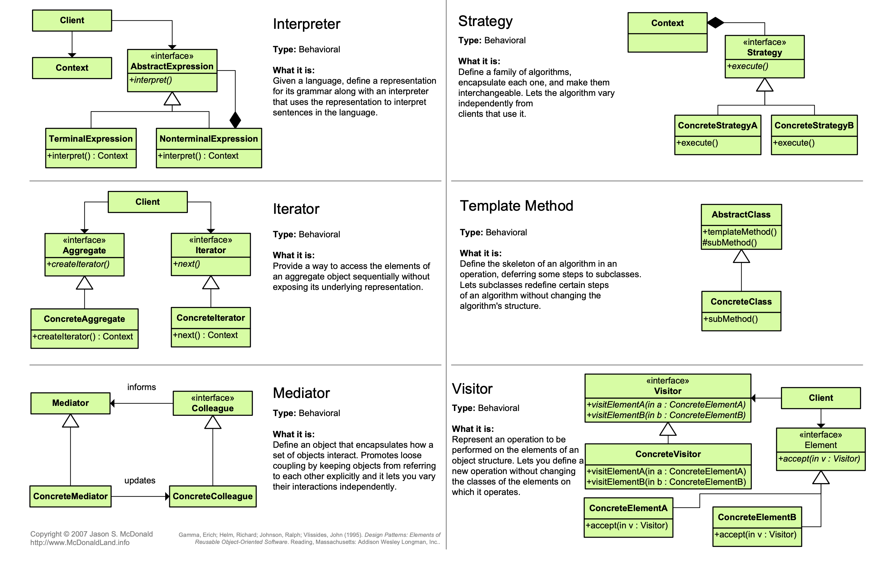 
 
 
  

## 1. 템플릿 메소드 패턴 (Template Method Pattern)
 
상위 클래스에서는 추상적으로 표현하고 그 구체적인 내용은 하위 클래스에서 결정되는 디자인 패턴. 
메소드에서 알고리즘의 골격을 정의한다. 
알고리즘의 여러 단계 중 일부는 서브클래스에서 구현할 수 있다. 
템플릿 메소드를 이용하면 알고리즘의 구조는 그대로 유지하면서 서브 클래스에서 특정 단계를 재정의 할 수 있다. 
알고리즘의 틀을 만들기 위한 패턴이다. 
이 패턴에서 틀(템플릿)이란 일련의 단계들로 알고리즘을 정의한 메소드다. 
여러 단계 가운데 하나 이상이 추상 메소드로 정의되며, 그 추상 메소드는 서브클래스에서 구현된다. 
이렇게 하면 서브클래스에서 일부분의 단계를 구현할 수 있도록 하면서도 알고리즘의 구조는 바꾸지 않도록 할 수 있다. 
어떤 작업을 처리하는 일부분을 서브 클래스로 캡슐화해  
전체 일을 수행하는 구조는 바꾸지 않으면서 특정 단계에서 수행하는 내용을 바꾸는 패턴. 
즉, 전체적으로는 동일하면서 부분적으로 다른 구문으로 구성된 메소드의 코드 중복을 최소화할 때 유용하다. 
다른 관점에서 보면 동일한 기능을 상위 클래스에서 정의하면서 확장/변화가 필요한 부분만 서브 클래스에서 구현할 수 있도록 한다. 
 
=> templateMethod 패키지 참조. 
https://jusungpark.tistory.com/24  
  

## 2. 프록시 패턴 (Proxy Pattern)
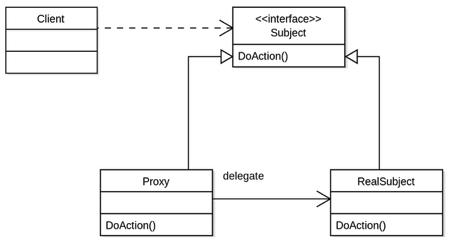 
클라이언트에서 프록시 클래스를 통해 간접적으로 주체 클래스를 사용하는 방식. 
프록시가 대리자로써 일을 처리하고 완료되면 결과를 알려주는 패턴. 
프록시의 의미는 "대리자"라는 의미이다. 
무언가를 대신해서 일을 해주는 사람을 말하는데 프록시패턴(Proxy Pattern)은 
대리자로써 일을 맡기면 그 일을 처리하고 완료되면 결과를 알려주는 패턴이다. 
#### * 프록시 종류
(1) 원격 프록시(원격에서 모니터링 하는 경우.) 
(2) 가상 프록시(이미지를 불러오는 동안 무언가 다른것을 보여주고 싶을 때.) 
(3) 동적 프록시(자바 리플렉션 사용. 프록시 클래스가 실행중에 생성됨. 사용자 권한에 따라 다른 페이지 보여줄 때.) 
(4) 방화벽 프록시(네트워크 자원에 대한 접근을 제어함으로써 객체를 공격자로부터 보호.) 
(5) 스마트 패턴 프록시(주 객체가 참조될 때마다 추가 행동을 제공. 래퍼런스 개수 세기 등.) 
(6) 캐싱 프록시(비용이 많이 드는 작업의 결과를 임시로 저장. 웹 서버 프록시, 컨텐츠 관리 및 퍼블리싱 시스템.) 
(7) 동기화 프록시(여러 스레드에서 주 객체에 접근하는 경우 안전하게 작업을 처리하게 해준다.) 
(8) 복잡도 숨김 프록시(퍼사드 패턴이 단순히 인터페이스만 제공하는 것에 비해 복잡도 숨김 프록시는 접근을 제어한다.) 
(9) 지연 복사 프록시(객체 복사를 제어한다.) 
 
=> proxy 패키지 참조. 
https://plposer.tistory.com/31  
https://meylady.tistory.com/58  
  

## 3. 퍼사드 패턴 (Facade Pattern)
 
많은 분량의 코드에 접근할 수 있는 단순한 인터페이스를 제공한다. 
인터페이스를 간단하게 바꿈. (for 간편함) 
어떤 서브시스템에 대한 간단한 인터페이스를 제공하기 위한 용도. 
퍼사드에서 고수준 인터페이스를 정의하기 때문에 서브시스템을 더 쉽게 사용할 수 있다. 
클라이언트와 서브시스템이 서로 긴밀하게 연결되지 않아도 되고 최소 지식 원칙을 준수하는데 도움을 준다. 
* 최소 지식 원칙: 정말 친한 친구하고만 얘기하라. 
 
=> facade 패키지 참조. 
https://jusungpark.tistory.com/23?category=630296  
  

## 4. 싱글톤 패턴 (Singleton Pattern)
 
인스턴스를 한번만 생성해서 사용하턴 패턴. 
해당 클래스의 인스턴스가 하나만 만들어지고, 어디서든지 그 인스턴스에 접근할 수 있도록 하기 위한 패턴. 
클래스에서 자신의 단 하나뿐인 인스턴스를 관리하도록 만든다. 
다른 어떤 클래스에서도 자신의 인스턴스를 추가로 만들지 못하도록 해야한다.  
멀티 스레드 환경에서 잘 고려해서 사용해야 한다. 
(동기화 사용 시 속도 저하 -> 부분적으로만 사용, 혹은 클래스 로딩 시 인스턴스 생성.)  
 
=> singleton 패키지 참조. 
https://jusungpark.tistory.com/16?category=630296  
  

## 5. 전략 패턴 (Strategy Pattern)
 
실행 중에 알고리즘을 선택할 수 있게 하는 패턴. 
알고리즘군을 정의하고 각각 캡슐화하여 교환해서 사용할 수 있도록 만든다. 
스트래티지 패턴을 활용하면 알고리즘을 사용하는 클라이언트와는 독립적으로 알고리즘을 변경할 수 있다. 
 
=> strategy 패키지 참조. 
https://jusungpark.tistory.com/7?category=630296  
  

## 6. 팩토리 패턴 (Factory Pattern)
객체를 만들어내는 공장을 만드는 패턴. 
 
### (1) 팩토리 메소드 패턴 (Factory Method Pattern) 
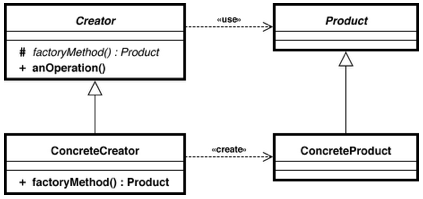 
클래스의 인스턴스를 만드는 일을 서브 클래스에게 맡기는 것. 
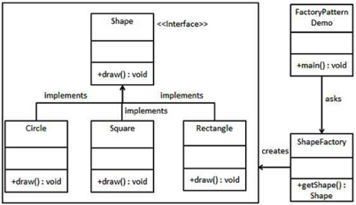 
생성할 객체의 클래스를 국한하지 않고 객체를 생성한다. 
 
### (2) 추상 팩토리 패턴 
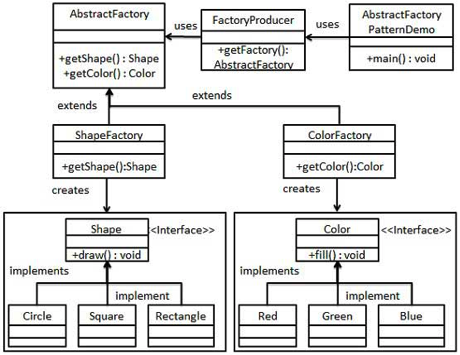 
인터페이스를 이용하여 서로 연관된, 또는 의존하는 객체를 구상 클래스를 지정하지 않고 생성하는 것. 
동일한 주제의 다른 팩토리를 묶어준다.  
 
=> factory 패키지 참조. 
factoryMethod 패키지와 재료 팩토리가 추가된 abstractFactory 패키지에서  
각각 NYPizzaStore 클래스의 createPizza()를 보면  
팩토리 메소드 패턴과 추상 팩토리 패턴에 대해 참조할 수 있다.  
https://jusungpark.tistory.com/14?category=630296  
https://stackoverflow.com/questions/5739611/what-are-the-differences-between-abstract-factory-and-factory-design-patterns  
  

## 7. 어댑터 패턴 (Adapter Pattern)
 
한 인터페이스를 다른 인터페이스로 변환. (for 호환성) 
인터페이스를 변경해서 클라이언트에서 필요로 하는 인터페이스로 적응시키기 위한 용도. 
어댑터를 이용하면 인터페이스 호환성 문제 때문에 같이 쓸 수 없는 클래스들을 연결해서 쓸 수 있다. 
 
=> adapter 패키지 참조. 
https://jusungpark.tistory.com/22?category=630296  
  

## 8. 데코레이터 패턴 (Decorator Pattern)
 
인터페이스를 바꾸지 않고 책임(기능)만 추가함. (For 기능 추가) 
객체에 추가적인 요건을 동적으로 첨가한다.  
서브 클래스를 만드는 것을 통해서 기능을 유연하게 확장할 수 있는 방법을 제공한다. 
- 데코레이터가 적용된 예: Java I/O  
InputStream이 추상 구성요소이고, 모든 보조 스트림의 조상인 FileInputStream이 추상 데코레이터이다. 
FileInputStream을 상속받아 구현하는 BufferedInputStream 클래스들이 구상 데코레이터이다. 
InputStream을 상속받는 FileInputStream 같은 기반 스트림들은 데코레이터로 포장될 구상 구성요소 역할을 한다.  
 
=> decorator 패키지 참조. 
https://jusungpark.tistory.com/9?category=630296  
  

## 9. 컴포지트 패턴 (Composite Pattern)
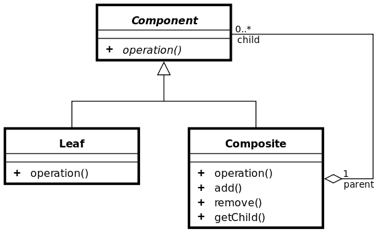 
객체들을 트리 구조로 구성하여 부분과 전체를 나타내는 계층구조로 만들 수 있다. 
클라이언트에서 개별 객체와 다른 객체들로 구성된 복합객체(composite)를 똑같은 방법으로 다룰 수 있다. 
식당 메뉴를 예로들어 생각해본다면 중첩되어 있는 메뉴 그룹과 메뉴 항목을 똑같은 구조내에서 처리할 수 있게끔 하는 것이다. 
메뉴와 메뉴항목을 같은 구조에 집어넣어서 부분-전체 계층구조를 생성할 수 있다. 
이런 복합구조를 사용하면 복합객체와 개별객체에 대해 구분없이 똑같은 작업을 적용할 수 있다. 
 
=> composite 패키지 참조. 
https://jusungpark.tistory.com/26?category=630296  
 
### * 컴포지트 패턴(Composite Pattern)과 데코레이터 패턴(Decorator Pattern)의 차이
<pre>
- 컴포지트 패턴(Composite Pattern) vs 데코레이터 패턴(Decorator Pattern)
컴포지트 패턴과 데코레이터 패턴은 비슷한 구조를 가지고 있는데,
이 두 패턴 모두가 여러 객체를 조직화하기 위해 재귀적 합성 기법을 사용하기 때문이다.
이런 구조적 유사성으로 데코레이터 패턴 객체를 약화된 합성 객체로 간주할 수도 있겠지만,
이는 데코레이터 패턴의 중요한 특성을 놓치고 있는 것이다.
이 두 패턴의 공통성은 구조에서만 나타날뿐 그 목적은 전혀 다르다.

데코레이터 패턴은 상속없이 객체에 새로운 서비스를 추가하려는 목적을 갖는다.
그러므로 이미 만들어둔 서비스 클래스들의 조합이 필요할 때마다 클래스를 생성하는 문제를 해결해야 한다.
컴포지트 패턴의 경우는 클래스의 구조화에 초점이 맞추어진 것으로
어떻게 하면 관련된 객체들을 하나의 인터페이스로 다룰 수 있도록 일관성을 부여할 것인가가 중요한 관건이다.
즉 여러 객체들을 하나의 객체로 통일시키고 싶은 것이다.

- 데코레이터 패턴(Decorator Pattern) vs 프록시 패턴(Proxy Pattern)
데코레이터 패턴과 비슷한 구조를 갖는 것이 하나 더 있는데 바로 프록시 패턴이다.
두 패턴 모두 다른 객체에 간접적으로 접근할 수 있고,
프록시와 데코레이터를 구현할 때 메시지를 전달할 상대 객체에 대한 참조자를 관리하는 공통점이 있지만, 두 패턴의 목적이 다르다.

데코레이터 패턴과 같이 프록시 패턴도 객체들을 합성하여 클라이언트에게는 동일한 인터페이스를 제공한다.
그러나 프록시 패턴은 데코레이터 패턴과 달리 동적으로 어떤 기능을 추가했다가 제거했다가 하지는 않는다.
프록시 패턴의 목적은 서비스를 제공하는 대상에 대한 참조자를 직접 관리하는 불편함을 해결하려는 것이다.
데코레이터 패턴을 사용하는 목적은 컴파일할 때 모든 서비스의 객체를 다 결정할 수 없는 상황에서 적절하게 대응하기 위해서다.

이런 차이들은 매우 중요하다.
구조가 비슷해 보여도 이들 패턴은 각기 서로 다른 객체지향 설계의 특정 문제를 해결하려는 목적을 가지고 있기 때문이다.
그렇다고 이들 패턴을 서로 합쳐서 사용할 수 없다는 것은 아니다.
프록시-데코레이터 쌍은 프록시 패턴에 추가적인 기능을 제공할 수 있고,
데코레이터-프록시 쌍의 경우는 원격지에 떨어진 객체에도 새로운 기능을 추가할 수 있게 한다.
이처럼 패턴의 조합은 매우 유용하다.
</pre>
https://gyrfalcon.tistory.com/entry/Adapter-vs-Bridge-Composite-vs-Decorator-vs-Proxy-%EB%B9%84%EA%B5%90  
  

## 10. 이터레이터 패턴 (Iterator Pattern)
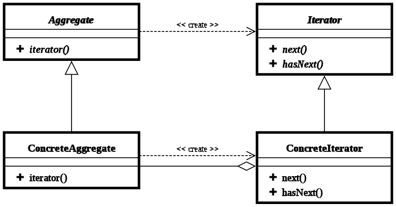 
반복이 필요한 자료구조를 모두 동일한 인터페이스를 통해 접근할 수 있도록 
메소드를 이용하여 자료구조를 활용할 수 있도록 해준다. 
컬렉션 구현 방법을 노출시키지 않으면서도 그 집합체 안에 들어있는 모든 항목에 접근할 수 있는 방법을 제공한다. 
컬렉션 객체 안에 들어있는 모든 항목에 접근하는 방식이 통일되어 있으면 
어떤 종류의 집합체에 대해서도 사용할 수 있는 다형적인 코드를 만들 수 있다. 
이터레이터 패턴을 사용하면 모든 항목에 일일이 접근하는 작업을 컬렉션 객체가 아닌 반복자 객체에서 맡게 된다. 
이렇게 하면 집합체의 인터페이스 및 구현이 간단해질뿐 아니라 
집합체에서는 반복작업에서 손을 떼고 원래 자신이 할 일(객체 컬렉션 관리)에만 전념할 수 있다. 
 
=> iterator 패키지 참조. 
https://jusungpark.tistory.com/25?category=630296  
  

## 11. 커맨드 패턴 (Command Pattern)
 
여러 명령어를 각각 구현하는 것이 아닌 하나의 추상 클래스에 메소드 하나를 만들고 
각 명령이 들어오면 그에 맞는 서브 클래스가 선택되어 실행되는 것. 
요구사항을 객체로 캡슐화 할 수 있으며, 매개변수를 써서 여러가지 다른 요구사항을 집어넣을 수 있다. 
또한 요청 내역을 큐에 저장하거나 로그로 기록할 수도 있으며 작업 취소 지원도 가능하다.  
커맨드 객체는 일련의 행동을 특정 리시버하고 연결시킴으로써 요구사항을 캡슐화한다. 
이렇게 하기 위해 행동과 리시버를 한 객체에 집어넣고 메소드 하나만 외부에 공개하는 방법을 사용한다. 
 
예) 식당을 예로 들어보자.  
(1) 손님이 웨이터에게 주문을 한다. 
(2) 웨이터가 고객의 주문을 주문서에 적는다. 
(3) 웨이터는 주문서를 주방에 전달하여 주문을 요청한다. 
(4) 요리사는 주문서에 적힌 주문대로 음식을 자신의 노하우로 만든다. 
- 손님 => 클라이언트
- 웨이터 => 인보커 객체
- 주문서 => 커맨드 객체
- 주방장 => 리시버 객체
- 주문을 하는 것 => setCommand()
- 주문을 요청하는 것 => execute()
 
=> command 패키지 참조.  
https://jusungpark.tistory.com/18?category=630296  
  

## 12. 옵저버 패턴 (Observer Patter)
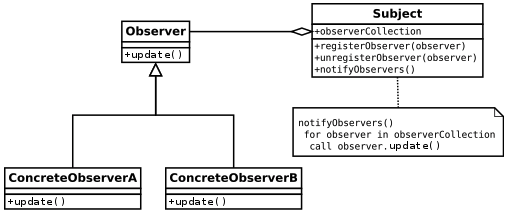 
어떤 클래스에 변화가 일어났을 때, 이를 감지하여 다른 클래스에 통보해 주는 것. 
한 객체의 상태가 바뀌면 그 객체에 의존하는 다른 객체들한테 연락이 가고  
자동으로 내용이 갱신되는 방식으로 일대다(one-to-many) 의존성을 정의한다. 
옵저버 패턴을 구현하는 방법에는 여러가지가 있지만 대부분 상태를 저장하고 있는 주제 인터페이스를 구현한 주제 객체와 
주제 객체에 의존하고 있는 옵저버 인터페이스를 구현한 여러개의 옵저버 객체가 있는 디자인을 바탕으로 한다. 
 
데이터 전달 방식은 2가지가 있다. 
 
(1) 주제 객체에서 옵저버로 데이터를 보내는 방식 (푸시 방식) 
-> observer.push 패키지 참조. 
 
(2) 옵저버에서 주제 객체의 데이터를 가져가는 방식 (풀 방식) 
-> 자바 9부터 deprecated 됨. 
-> 자바 내장 옵저버 사용하는 방식. 푸시 방식, 풀 방식 모두 사용가능.  
 
=> observer 패키지 참조.  
https://jusungpark.tistory.com/8?category=630296  
  

## 13. 스테이트 패턴 (State Pattern)
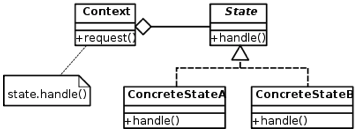 
동일한 동작을 객체의 상태에 따라 다르게 처리해야 할 때 사용하는 패턴. 
일련의 규칙에 따라 객체의 상태(State)를 변화시켜, 객체가 할 수 있는 행위를 바꾸는 패턴. 
 
=> state 패키지 참조.  
https://victorydntmd.tistory.com/294  
https://www.journaldev.com/1751/state-design-pattern-java  
  

## 14. 컴파운드 패턴 (Compound Pattern)
패턴 섞어 쓰기. 
반복적으로 생길 수 있는 문제를 해결하기 위한 용도로 두 개 이상의 패턴을 결합하여 사용하는 것을 뜻함. 
#### ** 대표적인 컴파운드 패턴 사용 예 => MVC 모델
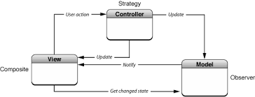 
https://m.blog.naver.com/PostView.nhn?blogId=cestlavie_01&logNo=221039978744&proxyReferer=https%3A%2F%2Fwww.google.com%2F  
https://secretroute.tistory.com/entry/Head-First-Design-Patterns-%EC%A0%9C12%EC%9E%A5-Compound-%ED%8C%A8%ED%84%B4  
  
=> compound 패키지 참조.  
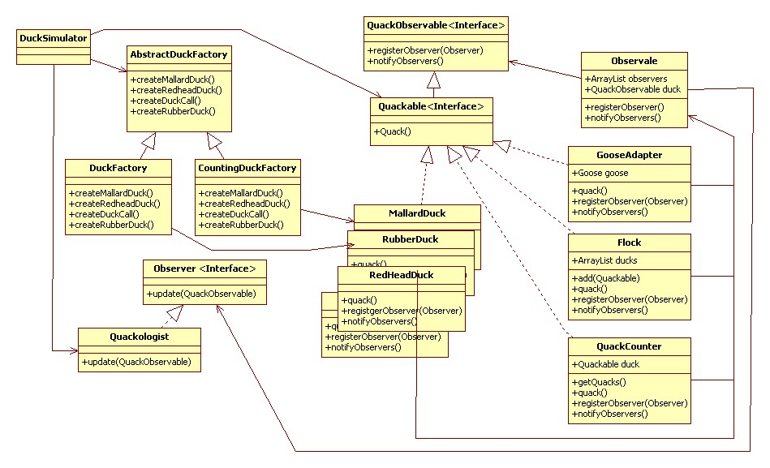 
<pre>
- 오리에 적용될 패턴.
(1) 처음에 수많은 Quackable들이 존재.
(2) 갑자기 거위가 나타나서는 자기도 Quackable이 되고 싶다고 함. (어댑터 패턴)
(3) 꽥 학자들이 등장해서 꽥 소리 횟수를 세고 싶다고 함. (데코레이터 패턴)
(4) 꽥 학자들이 QuackCounter로 장식되지 않은 Quackable 객체가 있을지도 모른다는 걱정을 함.
    모든 객체를 팩토리에서 만들도록 바꿈. (추상 팩토리 패턴)
(5) 모든 오리와 거위, Quackable 객체들을 관리하는게 힘들어지기 시작하여 오리떼 계층구조로 관리. (컴포지트 패턴)
(6) 꽥 학자들은 Quackable에서 꽥 소리를 냈을 때 알림을 받고 싶어함. (옵저버 패턴)
</pre>
http://wiki.gurubee.net/pages/viewpage.action?pageId=1507417  
  

## 15. 브리지 패턴 (Bridge Pattern)
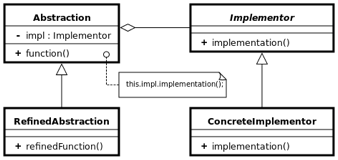 
구현부에서 추상층을 분리하여 각자 독립적으로 변형할 수 있게 하는 패턴. 
추상화와 구현을 분리해 둘을 각각 따로 발전시킬 수 있다. 
두 클래스 간의 강한 결합을 제거하기 위해서 사요하는 패턴이다. 
두 클래스 모두 추상화된 상위 클래스 또는 인터페이스를 가지게 되고, 의존성은 상위 타입간에만 이루어지게 된다. 
이를 통해 실제 의존성이 발생하더라도 서로의 구현체는 알 수 없도록 한다. 
이렇게 되면 두 상위 타입을 구현하는 구현체들은 변경이 가능한 상태가 된다. 
 
=> bridge 패키지 참조. 
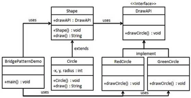 
https://www.tutorialspoint.com/design_pattern/bridge_pattern.htm  
https://ko.wikipedia.org/wiki/%EB%B8%8C%EB%A6%AC%EC%A7%80_%ED%8C%A8%ED%84%B4  
 
### * 어댑터 패턴(Adapter Pattern)과 브리지 패턴(Bridge Pattern)의 차이
구조 패턴은 코드와 객체를 구조화하기 위해 언어가 제공하는 아주 작은 범위의 개념을 이용하기 때문에 각 패턴이 구조가 비슷할 수 밖에 없다. 
이러한 패턴들의 차이점은 왜 이 패턴을 써야 하는가에 있다. 
<pre>
- 어댑터 패턴(Adapter Pattern) vs 브리지 패턴(Bridge Pattern)
어댑터 패턴과 브리지 패턴은 둘 다 객체에 대한 직접 접근 대신에 다른 우회적 방법으로 접근함으로써 유연성을 증대시킨다.
두 패턴간의 가장 큰 차이는 목적이 무엇인가라는 것이다.
어댑터 패턴의 목적은 이미 존재하는 두 인터페이스 간의 불일치를 해결하려는 것이다.
어댑터 패턴은 어떤 인터페이스를 어떻게 구현하게 할 것이라든가,
인터페이스와 구현을 독립적으로 발전시키는 방법은 무엇일까 등의 사항은 전혀 고려치 않는다.
이에 비해 브리지 패턴의 경우는 추상화 개념과 구현을 따로 만들고, 이들을 연결시키려는 것이 주 목적이다.
어댑터 패턴은 두 클래스 간의 종속성을 미리 예측하지 못하고 개발했을 경우에 필요한 패턴이고,
브리지 패턴은 이미 사용자가 추상화 개념을 구현하는 방법이 여러가지이고
이들 각각이 독립적으로 진화할 수 있음을 파악한 상태에서 적용하는 패턴이다.
</pre>
https://gyrfalcon.tistory.com/entry/Adapter-vs-Bridge-Composite-vs-Decorator-vs-Proxy-%EB%B9%84%EA%B5%90  
  

## 16. 빌더 패턴 (Builder Pattern)
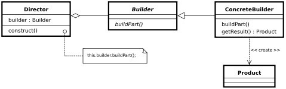 
생성(construction)과 표기(representation)를 분리해 복잡한 객체를 생성한다. 
객체 생성 알고리즘과 조립 방법을 분리하는 것이 목적. 
코드 읽기/유지보수가 편해짐. 
생성자 인자가 많을 때는 빌더 패턴을 고려. 
메소드 체인 방식으로 호출 가능.  
 
=> builder 패키지 참조. 
https://johngrib.github.io/wiki/builder-pattern  
  

## 17. 역할 사슬 패턴 (Chain Of Responsibility Pattern)
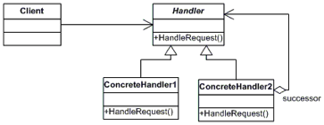 
여러 개의 객체 중에서 어떤 것이 요구사항을 처리할 수 있는지 사전에 알 수 없을 때 사용. 
 
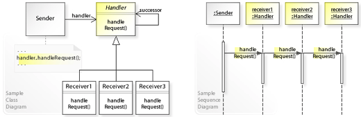 
요청 처리가 들어오면 그것을 수신한 객체가 자신이 처리할 수 없을 때 다음 객체에게 문제를 넘김으로써 
최종적으로 요청을 처리할 수 있는 객체에 의해 처리가 가능하도록 하는 패턴. 
 
=> chain 패키지 참조. 
https://lktprogrammer.tistory.com/45  
https://sexycoder.tistory.com/105  
http://www.nextree.co.kr/p2533/  
https://kunoo.tistory.com/entry/%ED%96%89%EC%9C%84-%ED%8C%A8%ED%84%B4-Chain-of-responsibility-pattern-%EC%97%AD%ED%95%A0-%EC%82%AC%EC%8A%AC-%ED%8C%A8%ED%84%B4  
  

## 18. 플라이웨이트 패턴 (Flyweight Pattern)
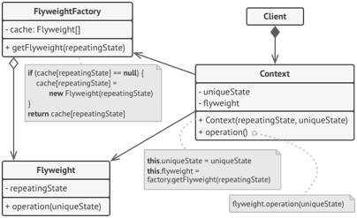 
다수의 유사한 객체를 생성 및 조작하는 비용을 절감할 수 있다. 
데이터를 공유하여 메모리를 절약하는 패턴으로 공통으로 사용되는 객체는 한번만 생성되고 공유 풀(Pool)로 관리, 사용된다. 
객체의 내부에서 참조하는 객체를 직접 만드는 것이 아니라, 
없다면 만들고, 만들어져 있다면 객체를 공유하는 식으로 객체를 공유하는 식으로 객체를 구성하는 방법이다. 
이렇게 하기 위해 대부분 팩토리 메소드 패턴을 사용하여 객체를 생성한다. 
팩토리 메소드 안에서는 플라이웨이트 객체를 새로 생성한다. 
이때 생성하는 객체가 내부적으로 참조하는 객체에 대해, 기존에 있는 객체를 참조만 하는 식으로 객체를 구성한다. 
이렇게 하면 객체 할당에 사용되는 메모리를 줄일 수 있을뿐 아니라, 객체를 생성하는 시간도 들지 않게 된다. 
플라이웨이트 패턴이 가장 많이 사용되는 사례는 바로 게임이다. 
게임에는 많은 UI widget 혹은 component 들이 존재하는데, 대부분 일정한 패턴의 UI가 연속되는 경우가 많다. 
이런 경우 플라이웨이트 패턴을 사용해 하나의 리소스를 여러 객체에서 공유하여 사용하는 방식으로 프로그래밍이 작성된다. 
 
=> flyweight 패키지 참조. 
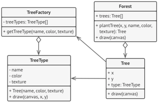 
<pre>
- 숲 그리기 코드 (자바 8버전 이하에서만 실행 가능. 9부터 애플릿이 사라짐.)
나무(8bytes) 1,000,000개에 대해 각각 나무 타입(30bytes)을 만들게 되면 용량이 36MB를 차지하게 된다.
하지만 나무 타입(30bytes)을 2개만 만들어서 사용하면 숲을 그리는데에 사용되는 용량을 7MB로 절약할 수 있다.
</pre>
https://refactoring.guru/design-patterns/flyweight  
https://m.blog.naver.com/2feelus/220669069127  
https://en.wikipedia.org/wiki/Flyweight_pattern  
 
### * 플라이웨이트 패턴(Flyweight Pattern)을 사용하는 자바의 String
두 개 이상의 같은 문자열이 코드에 정의되어 있더라도 String pool에는 하나만 저장되고 그 곳을 참조하는 방식. 
아래 두 클래스의 getStringA()와 getStringB()는 모두 같은 위치에 있는 "Hello"를 리턴한다. 
<pre>
public class A {
    public String getStringA() {
        return "Hello";
    }
}
public class B {
    public String getStringB() {
        return "Hello";
    }
}
</pre>
https://m.blog.naver.com/2feelus/220669069127  
<pre>
Returns a canonical representation for the string object.
A pool of strings, initially empty, is maintained privately by the class String.

When the intern method is invoked,
if the pool already contains a string equal to this String object
as determined by the equals(Object) method,
then the string from the pool is returned.
Otherwise, this String object is added to the pool and a reference to this String object is returned.

It follows that for any two strings
s and t, s.intern() == t.intern() is true if and only if s.equals(t) is true.

All literal strings and string-valued constant expressions are interned.
String literals are defined in §3.10.5 of the Java Language Specification
</pre>
https://stackoverflow.com/questions/11189155/is-javas-string-intern-a-flyweight  
  

## 19. 인터프리터 패턴 (Interpreter Pattern)
 
인터프리터 패턴은 행동 패턴에 속하며 언어 문법이나 표현을 평가할 수 있는 방법을 제공한다. 
특정 컨텍스트를 해석하도록 지시하는 표현 인터페이스를 구현하는 것을 포함한다. 
이 패턴은 SQL 구문 분석, 기호 처리 엔진 등에서 사용된다. 
 
=> interpreter 패키지 참조.  
https://donxu.tistory.com/entry/Interpreter-pattern  
https://kunoo.tistory.com/entry/%ED%96%89%EC%9C%84-%ED%8C%A8%ED%84%B4-Interpreter-pattern-%EC%9D%B8%ED%84%B0%ED%94%84%EB%A6%AC%ED%84%B0-%ED%8C%A8%ED%84%B4  
  

## 20. 중재자 패턴 (미디에이터 패턴, Mediator Pattern)
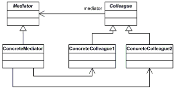 
클래스 간의 복잡한 상호작용을 캡슐화하여 한 클래스에 위임해서 처리하는 패턴. 
서로 관련된 객체 사이의 복잡한 통신과 제어를 한 곳으로 집중시키고자 할 때 사용. 
어떻게 객체들의 집합이 상호작용하는지를 함축해놓은 객체를 정의한다. 
이 패턴은 프로그램의 실행 행위를 변경할 수 있기 때문에 행위 패턴으로 간주된다. 
 
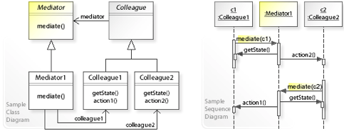 
중재자 패턴을 사용하면 객체 간 통신은 중재자 객체 안에 함축된다. 
객체들은 더이상 다른 객체와 서로 직접 통신하지 않으며 대신 중재자를 통해 통신한다. 
이를 통해 통신 객체 간 의존성을 줄일 수 있으므로 결합도를 감소시킨다. 
 
=> mediator 패키지 참조. 
https://ko.wikipedia.org/wiki/%EC%A4%91%EC%9E%AC%EC%9E%90_%ED%8C%A8%ED%84%B4  
https://palpit.tistory.com/201  
https://kunoo.tistory.com/entry/%ED%96%89%EC%9C%84-%ED%8C%A8%ED%84%B4-Mediator-pattern-%EB%AF%B8%EB%94%94%EC%97%90%EC%9D%B4%ED%84%B0-%ED%8C%A8%ED%84%B4  
  

## 21. 메멘토 패턴 (Memento Pattern)
Ctrl + z 와 같은 undo 기능을 개발할 때 유용한 패턴. 
클래스 설계 관점에서 객체의 정보를 저장. 
객체의 상태 정보를 저장하고 사용자의 필요에 의하여 원하는 시점의 상태로 복원할 수 있는 패턴. 
 
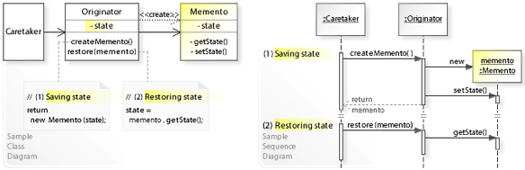 
- 메멘토 패턴은 3개의 객체로 구현된다. 
오리지네이터(originator), 케어테이커(caretaker), 메멘토(memento). 
오리지네이터는 내부 상태를 보유하고 있는 일부 객체이다. 
케어테이커는 오리지네이터에 대해 무언가를 하지만 변경에 대한 실행 취소를 하기를 원한다. 
케어테이커는 먼저 오리지네이터에게 메멘토 객체를 요청한다. 그 뒤 예정된 일련의 명령을 수행한다. 
명령 이전의 상태로 되돌리기 위해 메멘토 객체를 오리지네이터에 반환한다. 
메멘토 객체 자신은 불투명 자료형(케어테이커는 변경할 수 없거나 변경해서는 안되는)이다. 
 
=> memento 패키지 참조. 
https://ko.wikipedia.org/wiki/%EB%A9%94%EB%A9%98%ED%86%A0_%ED%8C%A8%ED%84%B4  
https://lktprogrammer.tistory.com/65  
  

## 22. 프로토타입 패턴 (Prototype Pattern)
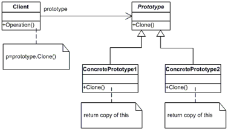 
기존 객체를 복제하여 객체를 생성한다. 
생성한 객체들의 타입이 프로토타입인 인스턴스로부터 결정되도록 하며, 인스턴스는 새 객체를 만들기 위해 자신을 복제(clone)하게 된다.  
- 프로토타입 패턴은 추상 팩토리 패턴과 반대로 
클라이언트 응용 프로그램 코드 내에서 객체 창조자(creator)를 서브클래스(subclass)하는 것을 피할 수 있게 해준다. (복제만 하도록) 
- 프로토타입 패턴은 새로운 객체는 일반적인 방법(예를 들어, new를 사용해서라든지)으로  
객체를 생성(create)하는 고유의 비용이 주어진 응용 프로그램 상황에 있어서 불가피하게 비용이 매우 클 때, 
이 비용을 감내하지 않을 수 있게 해준다. 
 
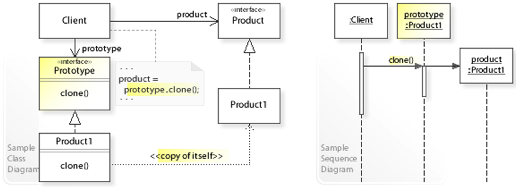 
 
=> prototype 패키지 참조. 
https://ko.wikipedia.org/wiki/%ED%94%84%EB%A1%9C%ED%86%A0%ED%83%80%EC%9E%85_%ED%8C%A8%ED%84%B4  
  

## 23. 비지터 패턴 (Visitor Pattern)
각 클래스의 데이터 구조로부터 처리 기능을 분리하여 별도의 visitor 클래스를 만들어놓고 
해당 클래스의 메소드가 각 클래스를 돌아다니며 특정 작업을 수행하도록 하는 것. 
 
=> visitor 패키지 참조.  
  

  

